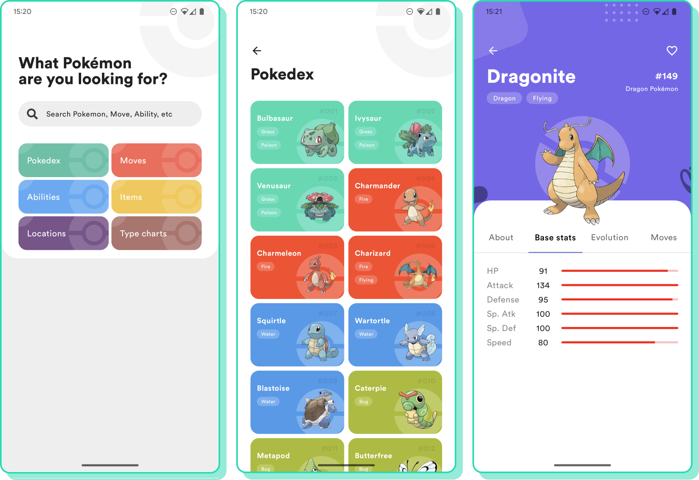

# Compose Pokedexer

Adapted fork of original [compose-pokedex](https://github.com/zsoltk/compose-pokedex) project

Notable changes:
- Upgraded dependencies: Compose -> BOM 2022.11.00, AGP -> 7.3.1
- Swapped out [composer-router](https://github.com/zsoltk/compose-router) for [Compose Navigation](https://developer.android.com/jetpack/compose/navigation) (2.4.0)
- Moved color resources -> Kotlin color constants

Notable additions:
- Added [Accompanist](https://github.com/google/accompanist) for edge-to-edge UI treatment
- Querying pokemon data via [GraphQL from PokeApi](https://pokeapi.co/docs/graphql), storing in local Room database
- Added Hilt for dependency injection, as well as ViewModels
- Simple use of RuntimeShader (requires API 33)

## Screenshots

## Original design

[Pokedex App design](https://dribbble.com/shots/6545819-Pokedex-App) by [Saepul Nahwan](https://dribbble.com/saepulnahwan23)

## License

All the code available under the MIT license. See [LICENSE](LICENSE).
