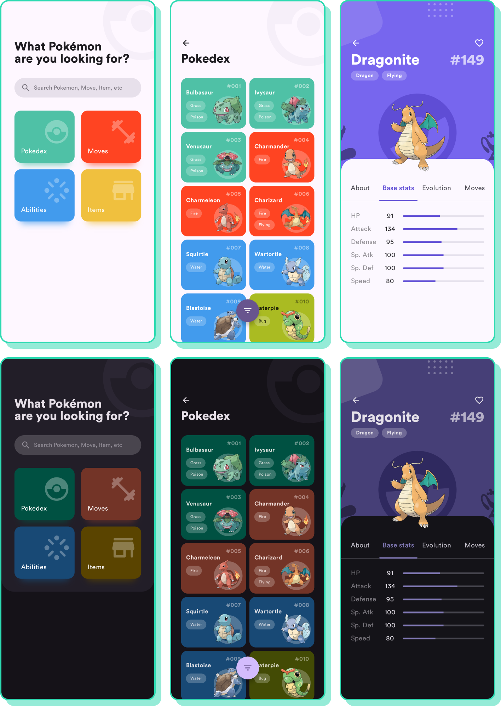

# Compose Pokedexer


A **Kotlin Multiplatform** Pokedex app with native **Android (Jetpack Compose)** and **iOS (SwiftUI)** frontends, sharing a common data layer.

Adapted fork of original [compose-pokedex](https://github.com/zsoltk/compose-pokedex) project.

## Features

- Browse Pokemon with a 2-column grid and animated mesh gradient cards
- Detailed Pokemon info: stats radar chart, evolutions, moves, abilities
- Horizontal pager to swipe between Pokemon
- Search across Pokemon, Moves, and Items with debounced input
- Filter by generation, type, and favorites
- Moves listing, Items listing, and Type Chart screens
- Dynamic theming per Pokemon type (Material Kolor)
- Dark theme support
- Shared data layer via Kotlin Multiplatform (Room KMP + Apollo GraphQL)
- Native iOS app with SwiftUI and iOS 18 MeshGradient support

## Notable Technical Choices

- **KMP shared module**: Room database, Apollo GraphQL client, data models, and repositories shared between Android and iOS
- **Jetpack Compose Navigation 3**: `NavDisplay` with `rememberNavBackStack` and type-safe serializable routes
- **Metro DI**: Dependency injection with assisted injection for ViewModels requiring runtime parameters
- **SKIE**: Kotlin Flow to Swift AsyncSequence interop for iOS
- **RuntimeShader**: Pager color transitions on API 33+ devices
- **Material Kolor**: Seed-based dynamic color generation across platforms
- **Coil**: Image loading with GIF support
- **DataStore**: User preferences (favorites) storage

## Screenshots



## Building

### Android

```bash
./gradlew assembleDebug
```

### iOS

Open `iosApp/PokedexerApp.xcodeproj` in Xcode and build for a simulator or device (iOS 18.0+).

The shared KMP framework is built automatically by the Xcode build phase, or manually:

```bash
./gradlew :shared:linkReleaseFrameworkIosSimulatorArm64
```

## Original design

Adapted from [Pokedex App design](https://dribbble.com/shots/6545819-Pokedex-App) by [Saepul Nahwan](https://dribbble.com/saepulnahwan23).

Notable additions:
- Dark theme
- Designs for all tabs on details screen
- Designs for Move, Abilities, and Items screens
- Designs for search

## License

All the code available under the MIT license. See [LICENSE](LICENSE).
